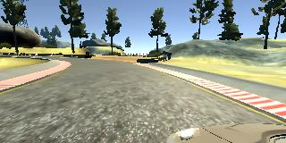

# **Behavioral Cloning**

## Writeup 

**Behavioral Cloning Project**

The goals / steps of this project are the following:
* Use the simulator to collect data of good driving behavior
* Build, a convolution neural network in Keras that predicts steering angles from images
* Train and validate the model with a training and validation set
* Test that the model successfully drives around track one without leaving the road
* Summarize the results with a written report


## Rubric Points
### Here I will consider the [rubric points](https://review.udacity.com/#!/rubrics/432/view) individually and describe how I addressed each point in my implementation.  

---
### Files Submitted & Code Quality

#### 1. Submission includes all required files and can be used to run the simulator in autonomous mode

My project includes the following files:
* model.py containing the script to create and train the model
* model_utils.py containing a function to parse recording logs and a generator to feed the model
* drive.py for driving the car in autonomous mode
* model.h5 containing a trained convolution neural network
* writeup_report.md summarizing the results
* video.mp4 with the model driving around the track (additional videos are linked from this document)

Additionally, the project repository also contains alternative versions of some of the files:
* drive_variable_speed.py for driving the car with an adaptive speed.
* model_throttle branch with the model used to test the approach of predicting both steering angle and throttle input, as described below.

#### 2. Submission includes functional code
Using the Udacity provided simulator and my drive.py file, the car can be driven autonomously around the track by executing
```sh
python drive.py model.h5
```

#### 3. Submission code is usable and readable

The model.py file contains the code for training and saving the convolution neural network. The file shows the pipeline I used for training and validating the model, and it contains comments to explain how the code works.

### Model Architecture and Training Strategy

#### 1. An appropriate model architecture has been employed

My model consists of a convolution neural network with RELU activations to introduce nonlinearity (code lines 19,22,27).  The data is normalized in the model using a Keras lambda layer (code line 18), and Batch Normalization is applied after each Convolution (lines 20 and 23)

#### 2. Attempts to reduce overfitting in the model

The model contains a dropout layer in order to reduce overfitting (model.py lines 26).

The model was trained and validated on different data sets to ensure that the model was not overfitting (code line 11). The model was tested by running it through the simulator and ensuring that the vehicle could stay on the track.

#### 3. Model parameter tuning

The model used an adam optimizer with default learning and decay rates (model.py line 31), that were not manually tuned.

#### 4. Appropriate training data

Training data was chosen to keep the vehicle driving on the road. I used a combination of center lane driving and recover drives (from the left and right sides of the road to the center) in the main track and a drive around a different track.

For details about how I created the training data, see the next section.

### Model Architecture and Training Strategy

#### 1. Solution Design Approach

The overall strategy for deriving a model architecture was to start with a very simple architecture, including additional layers while performance kept increasing.

My first step was to use a neural network with a single convolution layer followed by a fully connected layer that mapped the flattened input to a single output unit (that'd predict steering angles)

In order to gauge how well the model was working, I split my image and steering angle data into a training and validation set (20% of the samples).

A dropout layer was included as soon as the basic architecture was tested, so  overfitting was not an issue: mean squared error on the training set and validation sets went in most cases in the same direction, with the only occurrence of overfitting in a test with more epochs on a particular model.

Given the asymmetrical nature of the input images, convolution layers and max pooling layers were given asymmetrical kernels, to reach a square output (20x20 before flattening).

The final step was to run the simulator to see how well the car was driving around track one. The car often drove off track, even with deeper models (up to 6 convolution layers and 2 fully connected layers were tested). Improving training data as explained below allowed the use of a shallower model.

At the end of the process, the vehicle is able to drive autonomously around the track without leaving the road, as can be seen in the next video (click to view):

[](http://www.youtube.com/watch?v=kDgHNNDrmJ8 "Track 1")

#### 2. Final Model Architecture

The final model architecture (model.py lines 14-28) consisted of a convolution neural network with the following layers:

|Layer|Kernel size|Output Shape|
|-----|-----------|---------------|
|Input   |   |160x320x3|
|Cropping||80x320x 3|
|Lambda   |   |80x320x 3   |
|Convolution|5x11 same padding|80x320x32|
||RELU Activation         ||
|Batch Normalization   |   | 80x320x32  |
|Max Pooling   | 2x4  | 40x 80x32  |
|Convolution|5x11 same padding|40x 80x64|
||RELU Activation ||
|Batch Normalization   |   | 40x 80x64  |
|Max Pooling   |   2x4| 20x 20x64  |
|Flatten  |   | 25600  |   
|Dropout   | 0.5     |25600   |
|Fully connected  |  | 256  |   
|Fully connected   |   |  1 |  


#### 3. Creation of the Training Set & Training Process

To capture good driving behavior, I first recorded two laps on track one using center lane driving. Here is an example image of center lane driving:


I then recorded the vehicle recovering from the left side and right sides of the road back to center so that the model would learn to bring the vehicle back to the center of the lane when needed. These images show what a recovery looks like starting from the left of the lane:


Then I recorded a drive on track two in order to get more data points. In this case, the lane was quite narrow to allow for recovery drives.

These data was fed to different models of increasing complexity, but the quality of the data was questionable, as it was very hard to keep the car in the lane for recorded laps, and tests on the simulator showed that all models failed similarly.  
A whole new set of laps was generated using a steering wheel, and this higher quality data showed that the best performing model was not the deepest.
Training data quality was still identified as an issue in this project, as the simulator is clearly not up to the task (driving inside the lane should be trivial, as is on real life).

##### 3.1. Data augmentation
To augment the data sat, two strategies were used:
* Flipped images and reversed angles so left and right turns are equally trained.  For example, this image:

  

  generates this image, associated with the same steering input, but in the opposite direction

  
* Images from lateral cameras, with adjusted steering angles. For example, these three images were captured simultaneously:



Images from lateral cameras were also flipped, so after recording 14,756 original images, 88,536 were available for training (x3 including lateral cameras, x 2 flipping images)

Images were fed to the model by a generator, that randomly shuffled the data set before each epoch.

I used this training data for training the model. The validation set helped determine if the model was over or under fitting. The ideal number of epochs was 5. Tests were run with 7 and 10 epochs, but error was not going down for the validation set most of the times after epoch 5, and overfitting (increasing validation error) appeared in epoch 6 or 7, except for the deeper models, that were not further tested after it was evidenced that they performed worse that the chosen architecture.

#### 4. Additional tests
##### 4.1. Second track
The model was used to try to drive in the second track. It invaded the left lane at times, and ended getting stuck, but it performed reasonably well, specially considering how difficult it was for me to drive in that track!
A recording of the autonomous drive can be seen here:
[](http://www.youtube.com/watch?v=YifOUg6EjyA "Track 1")

##### 4.2 Adaptive speed
An attempt to modify the drive.py file with target speed depending on the steering angle was implemented. The results were acceptable for the first track, altough the slowest speeds were reached at the exit of turns instead of during the turn, as the simulator had some lag implementing the required throttle values (when an order was executed, 5 other were already issued).
A video of the drive can be seen here:
[](http://www.youtube.com/watch?v=uBrxnIdwMXU "Track 1 - Adaptive speed")


##### 4.3 Predicting throttle
A model was trained attempting to predict both steering and throttle values. Predicted throttle resulted initially in very high speeds, and even after setting a max speed, produced erratic drives.
The second track could not be driven at all with this model, as not enough throttle was applied to climb slopes.
My suspicion is hat the problem stems from training data, as it had to be generated so carefully, throttle values are probably not representative of a regular drive (frequent slow downs, and associated speed ups in random places). The most inconsistent values, of course, were those from the recovery data, as all recoveries started with the car stopped, and full throttle applied, but even after ignoring those values, the results were not satisfactory.
